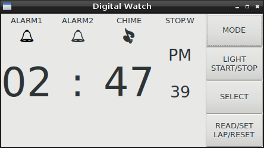

# Digital Watch

Demonstration of statecharts using a digital watch. The example is
based on the digital watch described in Harel's paper.

The statechart is implemented using Sismic, GTK+ and Python.

## Dependencies

Requires:

  * GTK+
  * GStreamer
  * Sismic

## Usage

    python3 -m watch
